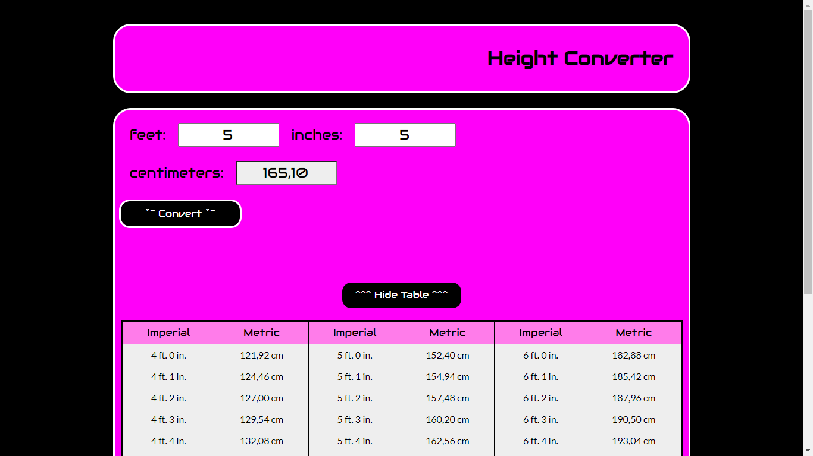

# Height Converter

## DEMO:
[click to visit](https://radekw86.github.io/Height-Converter/)

This simple converter lets you convert height given in **feet+inches** to **centimeters** and preview the *conversion table*.

## Technologies:
<ul>
<li>html</li>
<li>CSS & BEM</li>
<li>JS ES6+</li>
<li>Typescript</li>
</ul>
  

